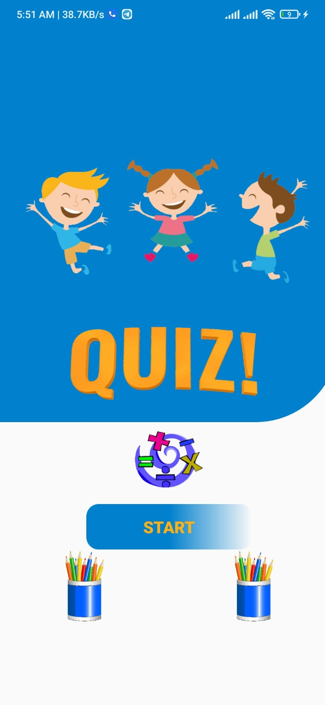
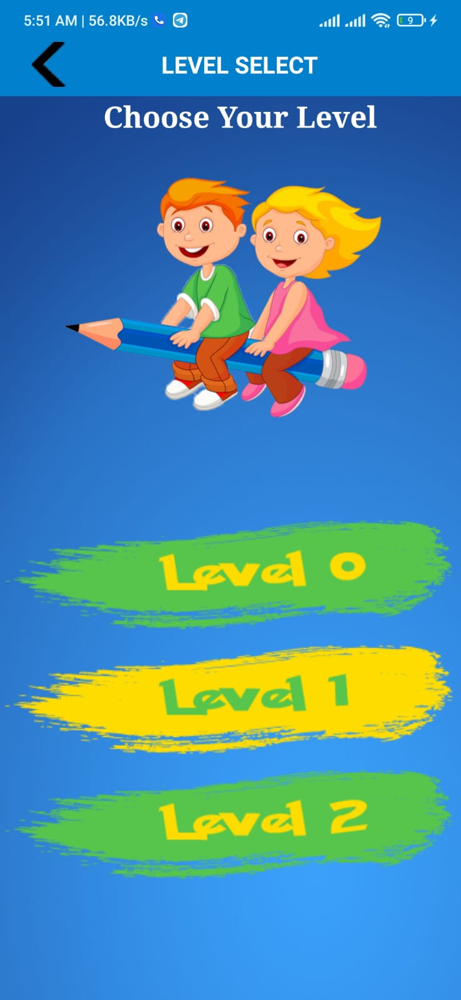
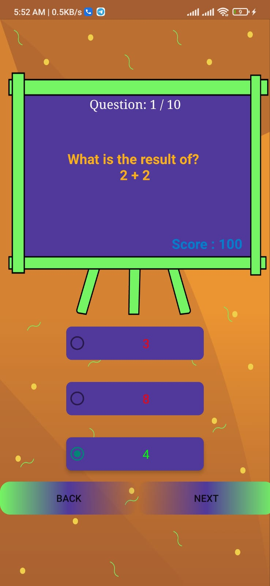
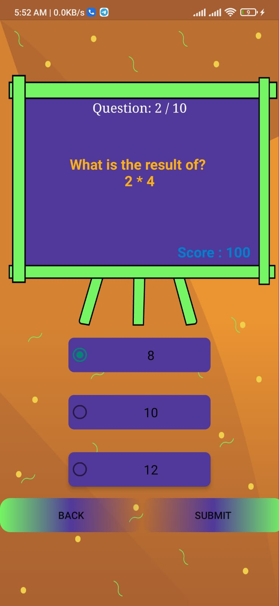
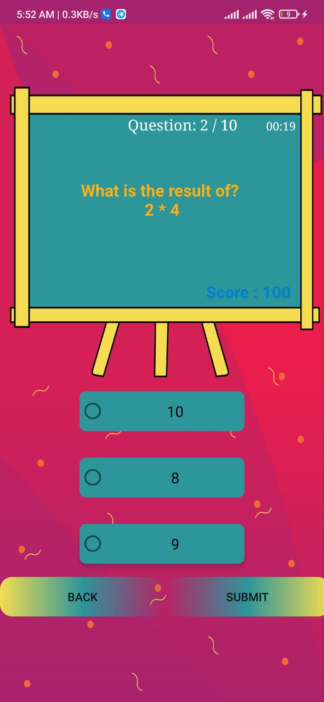

<h1> Quiz-Game </h1>
 
<h1> First Screen </h1>
 

 

<h1> Levels </h1>
 
<h2> The higher the level, the less time it takes to solve the question </h2>
 

 

<h1> First Level </h1>
 
<h2> Each correct answer the greeting sounds turn on </h2>

 

<h1> First </h1>
 

 

<h1> Cart </h1>
 

 

<h1> Firebase </h1>
 

 

 

